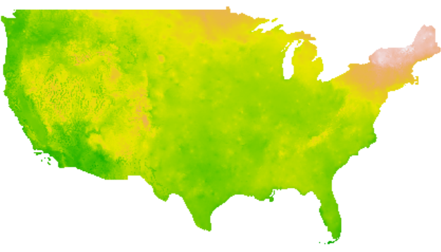

# rainbow

Extract data from PRISM weather rasters (daily/monthly/annual)

This R package is for extracting daily, monthly, and annual climate data from the proprietary version of the **Parameter Regression on Independent Slopes** or **PRISM** climate raster data set for the coterminous United States (Daly et al. 2002). Extractions can be for specific dates or a user-defined temporal window preceding and including each date. The package is especially useful for working with the proprietary version of the data set. PRISM is produced by the [PRISM Climate Group](https://prism.oregonstate.edu) at Oregon State University.  
 
  

The package contains three exported functions:
* `rbExtractDaily`: Extract daily values
* `rbExtractMonthly`: Extract monthly values
* `rbExtractYearly`: Extract annual values

Each function operates similarly and requires:
* A data frame with coordinates and event dates.
* Pointers to the base folder with PRISM data.  

Users can extract data for the day/month/year of each record plus all preceding days/months/years across a user-defined temporal window. For example, you could use `rbExtractDaily` to get all daily minimum temperature (`tmin`) values for a location for April 24th, 2014 and the 280 days prior to that date. Or, for example, you could use `rbExtractMonthly` to get the mean monthly value of minimum temperature for April of 2014 and the 18 months preceeding that. Or, using `rbExtractYearly`, you could obtain annual values for 2014 and the 10 years prior to that.  Of course, to get the values for the specied dates and windows preceeding them, you would need to possess the appropriate rasters.

The `rainbow` package uses functions from `lubridate` for handling dates and `terra` for handling rasters.

### Installation ###
You can install this package in R using this command:

`if (!require(remotes)) install.pakages('remotes')`
`remotes::install_github('adamlilith/enmSdm', dependencies=TRUE)`  

If for some reason this does not work, you can install the package by downloading the latest zip/tar file from the `zipTarFiles` directory and installing it manually.

### Examples ###
`x <- data.frame(`  
`	long=rep(-97.66, 5),`  
`	lat=rep(38.37, 5),`  
`	date=c('2015-12-31', '1981-01-05', '2020-12-01',`  
`	'2019-01-05', '1895-05-01')`  
`)`  

Extract daily minimum temperature at the given coordinate for five dates and the seven days preceding them:  
`y <- rbExtractDaily(`  
`	x,`  
`	dateField = 'date',`  
`	longLat = c('long', 'lat'),`  
`	prismDir = 'F:/PRISM/an81',`  
`	rastVars = 'tmin',`  
`	windowYears = 0,`  
`	windowDays = 7`  
`)`  

Extract monthly minimum temperature at the given coordinate for five dates and the seven months preceding them:  
`y <- rbExtractMonthly(`  
`	x,`  
`	dateField = 'date',`  
`	longLat = c('long', 'lat'),`  
`	prismDir = 'F:/PRISM/lt81',`  
`	rastVars = 'tmin',`  
`	windowYears = 0,`  
`	windowMonths = 7`  
`)`  

Extract annual minimum temperature at the given coordinate for five dates and the seven years preceding them:  
`y <- rbExtractYearly(`  
`	x,`  
`	dateField = 'date',`  
`	longLat = c('long', 'lat'),`  
`	prismDir = 'F:/PRISM/lt81',`  
`	rastVars = 'tmin',`  
`	windowYears = 7`  
`)`  

Adam B. Smith

### Literature cited ###
Daly, C., Gibson, W.P., Taylor, G.H., Johnson, G.L., and Pasteris, P.  2002.  A knowledge-based approach to the statistical mapping of climate.  *Climate Research* 22:99-113. [DOI: 10.3354/cr022099](http://dx.doi.org/10.3354/cr022099)
